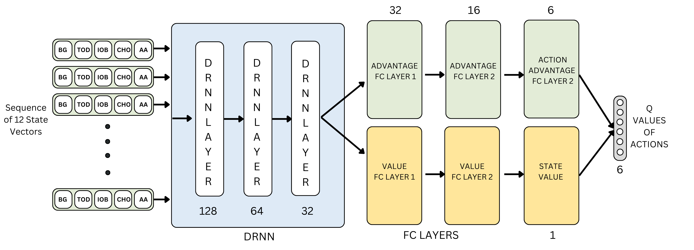
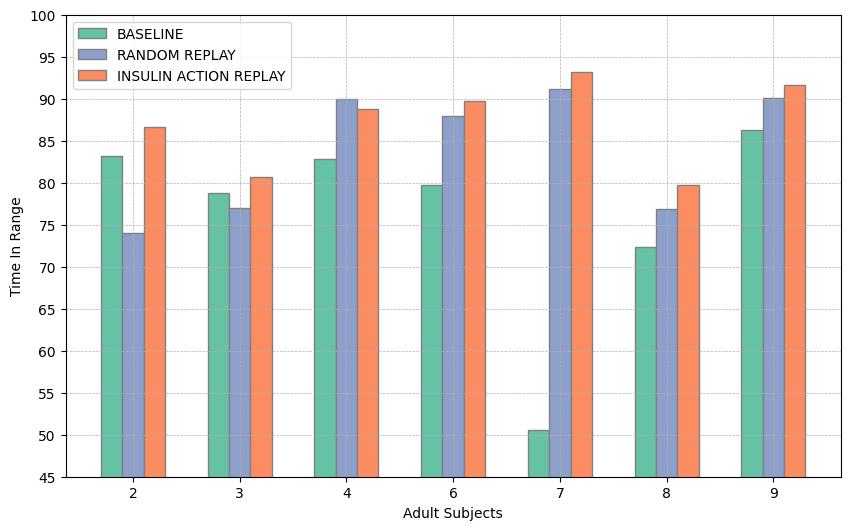

# Dual Hormone Controller for Type 1 Diabetes based on Dueling Deep Q-Network and Insulin Action Replay
## Research Paper Abstract
Type 1 Diabetic patients require exogenous insulin delivery to maintain normal blood glucose levels. Recent advancements in diabetes technology, such as Artificial Pancreas (AP) systems, have improved management by enabling Closed-loop Continuous Subcutaneous Insulin Infusion (CSII), reducing patient burden and lowering the risk of hypoglycemia. Traditional control algorithms like PID (Proportional-Integral-Derivative) and MPC (Model Predictive Control), commonly used in insulin pumps, improve glycemic control but often lack adaptability to the changing physiological state of a patient. In this study, we propose a Reinforcement Learning (RL)–based Deep Q-Learning Agent to control insulin delivery in Type 1 Diabetic patients. Our method utilizes dual hormone therapy to automate the delivery of basal insulin and glucagon for enhanced glucose management. A novel technique, Insulin Action Replay, addresses the delayed effects of insulin during agent training. Using the Food and Drug Administration (FDA) approved University of Virginia/Padova Type 1 Diabetes Simulator, we conducted in silico experiments on ten individuals from both adult and adolescent cohorts. Compared to the standard Basal-Bolus Treatment with Low Glucose Suspend, our model showed superior Time-in-Range (TIR) performance. For the adult cohort, our approach achieved 87.2% TIR, outperforming the random replay (83.8%) and baseline (76.2%) models. Similarly, the adolescent cohort showed improvements with 87.2% TIR, compared to 86.4% for random replay and 75.6% for the baseline. These results suggest that our approach enhances adaptability and could supplement current methods in glycemic control.
## Paper currently submitted to Elsevier Engineering Applications of AI
## Preliminary Project Report can be [Found Here](https://drive.google.com/file/d/1VJw55jo6CJ9IndpK_uU9YZLi2GxPjd6G/view?usp=sharing)

## Model Architecture

## Results

